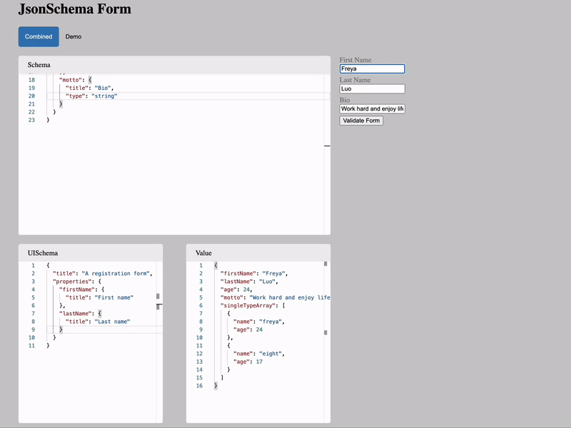

# form-generator

### Project Overview

Based on the user inputs, which are essentially JSON Schemas, this application automatically generates HTML Forms for them. The type keyword in the input schema defines what kind of form field users want to render. The available options include string, number, array, and object. In addtion, nested data structures are also supported. For example, with single typed array, user can either specify items to be primitive types, like string, or reference types, like object type. Multiple typed array can have different types in one single array, however, each element must be explicitly specified.

Another feature of this form generator is to validate form fields, which takes the advantages of JSON Schema Ajv validator.

However, users may need to render their own forms in different ways, and this requires each individual form component to be independent from others. One of the most important improvement is extracting all rendering logic into a theme provider while keeping the underling business logic inside the original component. By applying the similar design pattern, users can even customize JSON Schema validators and formats to gain more flexibility.

#### Note

- Why `.jsx/tsx` files are recommended instead of `.vue`files?
  - `.vue` format cannot be fully supported by TS, so customized components with self-defined props won't be checked by TS
  - So, changing from `.vue` to `.tsx` to enable TS static type checking

#### vuejs/rfcs

https://github.com/vuejs/rfcs/tree/master/active-rfcs
